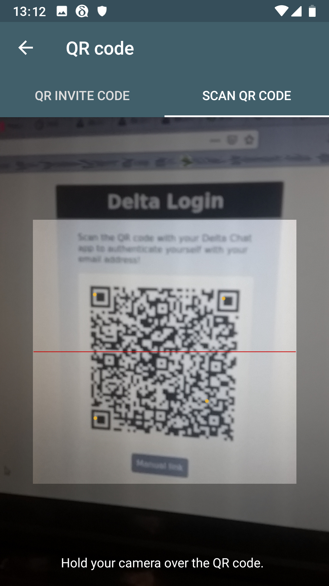
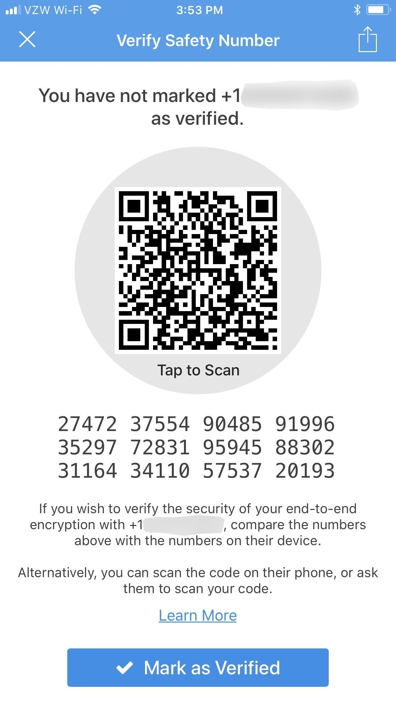
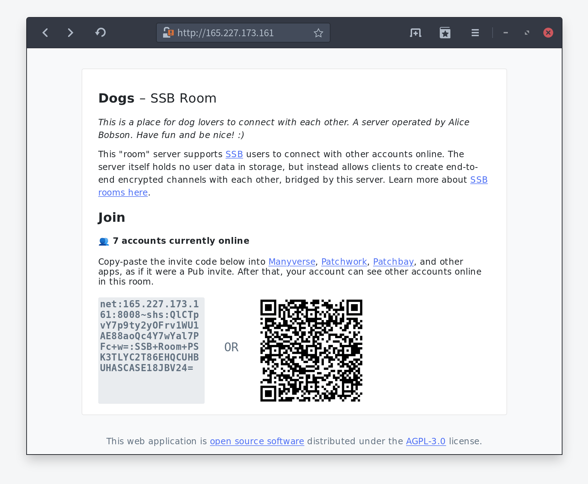
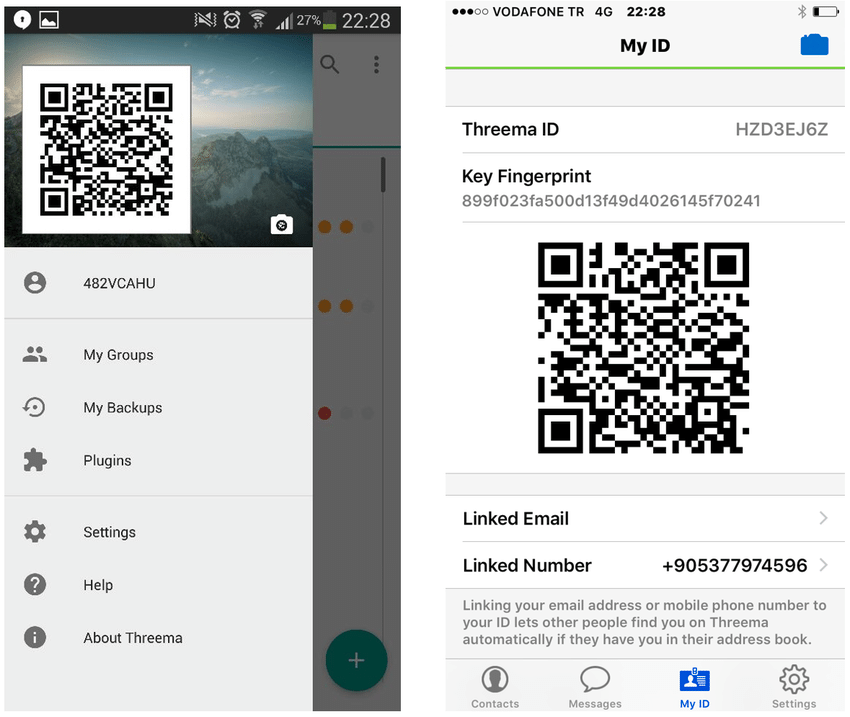

## The Design Problem

Use QR codes to quickly scan and verify that a device or some information is secure. In a typical centralized application, we trust the person or company operating the website to verify content. A particular profile or piece of content is mediated by this central server.

However, decentralized applications often rely upon very long strings of characters and/or numbers to identify people or a piece of information, especially for secure communication or secret groups. These very long URLS can be difficult to share in some cases.

## The Design Solution

In a decentralized world, QR codes no longer have to link to a centralized shared item. Instead, you can embed information directly in the QR code to share with peers. QR codes can also be exported or printed as an image and sent over a third-party service such as WhatsApp.

## Examples

::: examples

- [ delta.chat for verfied groups](qr-code-deltachat.png)

- [ Signal for verified devices](qr-code-signal.png)

- [ Secure Scuttlebutt for invitations](qr-code-ssb.png)

- [ Threema makes QR Code prominent as part of the user id](qr-code-threema.png)

::: examples

## Why Choose QR Code Verifcation?

When you want to securely verify or transfer information between two peers.

## Best Practice: How to Implement QR Code Verification

Tell users when the QR code is safe to share publicly or should only be shared with trusted peers.
Allow users to load the QR code as an image in case their camera is broken or unusable.

## Potential Problems with QR Code Verification

Long pass phrases (such as a [mnemonic code](https://en.wikipedia.org/wiki/Mnemonic)) is more complex than showing and scanning a QR code or importing a backup file. However, these long phrases may be useful instead of QR codes in low-bandwidth scenarios where image uploading is costly or time consuming. If used instead of a QR Code, mnemonic phrases should be translated into the user's native language.

## The Take Away

QR Code Verification is a user-friendly approach to transfer and verify information in decentralized systems.

## References & Where to Learn More

https://www.usenix.org/system/files/conference/soups2018/soups2018-vaziripour.pdf
