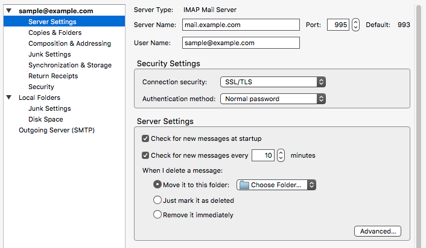
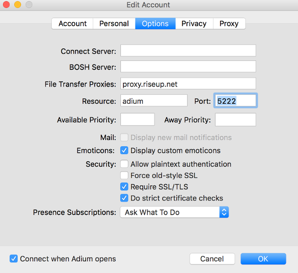
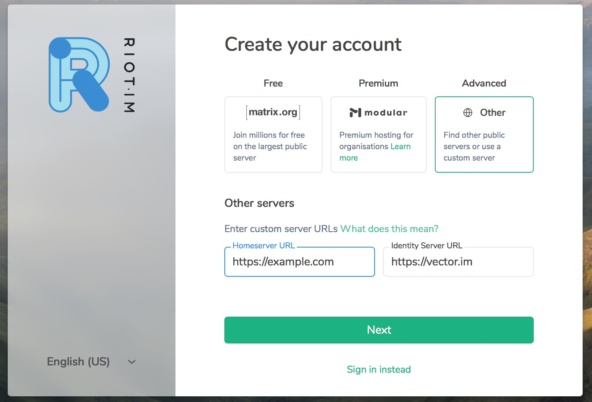

## The Design Problem

In a centralized world, it's assumed that other users are mediated through the
same service. For example, my handle (e.g., @okdistribute) on Twitter is
displayed the same to everyone else on Twitter. There is a global Twitter
database of these handles, and no one can use the same as someone else. If
I change my handle, it might be difficult for others to find me unless I tell
them my new name.

In a decentralized world, users may not be connecting to you from the exact
same service or application that you are. Data can be hosted by different
parties, and handles could be displayed differently depending on the
application or service each person is using to connect. There may also be many
different databases that guide what names are available or not, leading
to two users to have the same username. Because of this, a username alone is
often not sufficient to understand who you're talking to.

## The Design Solution

Users are uniquely identified by their handle and a server name.

## Examples

::: examples

- [ Email is the classic example of addresses (shown: a Thunderbird client)](address-thunderbird.png)

- [ XMPP has addresses similar to Email (shown: Adium app)](address-adium.png)

- [ Matrix gives more visual guidance for address choice](address-matrix.png)

::: examples

## Why Choose Address ?

- When users need to have a dedicated server that is always on and can receive messages or information from other users.

## Best Practice: How to Implement Address

- Make sure that names are unique on the same instance.
- Two users on the same device should be able to have two different
  names on separate instances.

## Potential Problems with Address

It is often complex for a user to convert their username, account, contact list, and data to a new server. In practice, most users then do not transfer to a new server even if they become unhappy with their current one.

If the user does decide to move to a new server, the user then needs to take on
the cumbersome task of notifying all contacts of their new address. Recipients
would need to trust your new address, without strong proof if it is the same
person or even the same device. See [[Persistent
Identity]] for making portability more secure.

## The Take Away

Address can help give users trust in who they're talking to.

## References & Where to Learn More
