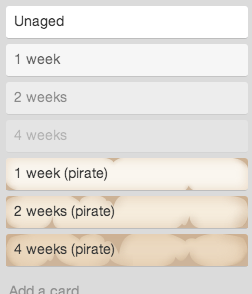

## The Design Problem

In a local-first world, peers may or may not be connected at all
times, and information left by the users could be out-of-date.

## The Design Solution

Give a visual indication for the age of a piece of information, for example
when a peer was last seen. Fading a tag or a card usually works.

## Examples

::: examples

- [ Trello's Card Aging](age-indicator-trello.png)

::: examples

## Why Choose Age Indicator?

Age indicator shows you information about participants without taking up too much space. It comes in handy to distinguish if information is viral or stale.

## Best Practice: How to Implement Age Indicator

- Age Indicator is most effective when it comes to time sensitive information,
  like a 'best-before-date' feature. It highlights when something needs to be
  checked for validity. As such, it enables an assertion of truth as
  information gets referenced over time.
- Make sure context is always clear.
- Use Age Indicator in combination with a [[network health
indicator]] to give advanced users more fine-grained detail.

## Potential Problems with Age Indicator

- **Dimensions**. When there are multiple dimensions of ways information could
  age, it can be difficult to know what is being displayed. Is it when a peer
  was last seen? The last time this file was updated? Use age indicator coupled
  with clear visual cues about what about that information has aged.
- **Contrast**. Ensure you pick a color contrast that allows for fading.
- **Action**. A single visual indication is not enough to accommodate both spectrums of the
  'aging' quality: Is it becoming irrelevant and out-of-date? Or has it become
  more valuable with the increased engagement over the course of time? Consider
  recommending an action (if any) that could be taken based upon the age of the content.

## The Take-Away

Age indicator helps guide users when the age of content affects how a user
should interact with it.

## References and Where To Learn More
