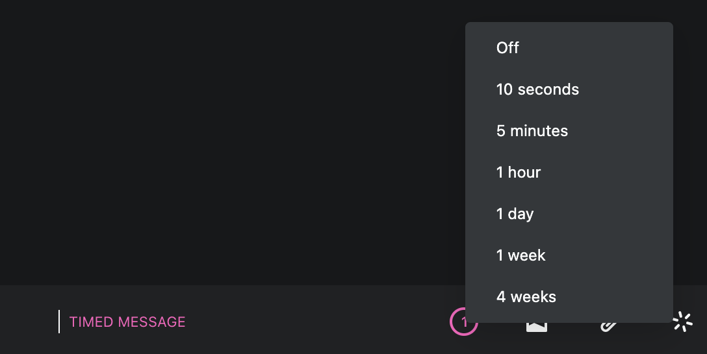
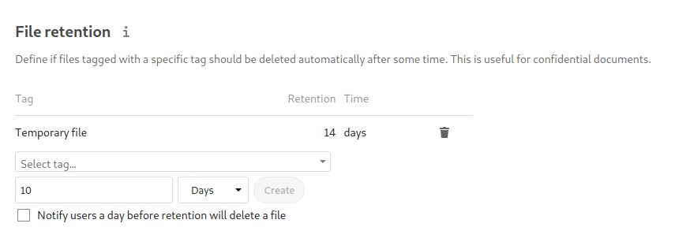

### The Design Problem

In a centralized world, all content is managed by a single provider. It controls
when and where data is stored.

However, peer-to-peer applications like BitTorrent flip this concept on its
head. There is no single provider who decides when and where data is stored; instead,
anyone with access to the data can choose to re-host it to others at their
discretion. Similarly, in federated applications, it's hard to know when and
how your data is being shared between instances.

### The Design Solution

- Allow users to set **parameters** for what to host. For example, "host until
  next week" or "share only users with property X". This can also be useful when
  trying to improve application or protocol performance if there are many
  users on the network.
- **Create incentives** that encourage hosting less popular content. For example,
  "Users who share datasets with less than 5 peers get a free gold account." See [[Cautious Optimism]] for more details.

#### Examples

::: examples

- [ Wire offers timed messages](Wire.png)

- [ Nextcloud' retention can be filtered by tag](nextcloud.png)

:::

### Why Choose Conditional Sharing?

When there is a large amount of information on the network with varied relevance and popularity.

### Best Practices: How to Implement Conditional Sharing?

- Ensure you can control with whom data is shared and when, including
  individual blocks of data.
- Create smart defaults based on the type of information and group dynamics of
  your application, but allow users to modify this easily using sliders and
  toggles.

### Potential Problems with Conditional Sharing

- There are maybe still copies of data after the conditions are no longer met.

### The Take-Away

Conditional sharing helps users collectively keep data online when it needs to be without a central coordinator.

### References and Where to Learn More

Integrating the data availability layer (p2p redundant hosting) with tracking where data is being shared can provide insight into how data is being used by peers. See [[network health indicator|network health indicators]] for more.
