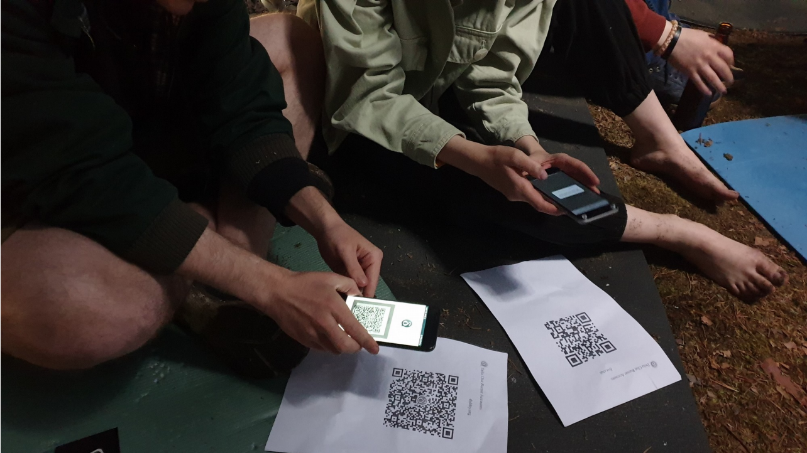
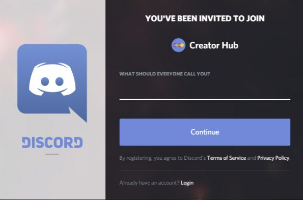
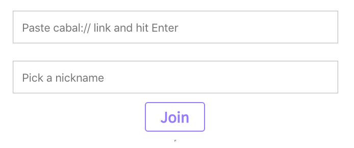

### Why Choose Disposable Identity?

- When you want to allow for a privacy-preserving method of connecting
  with trusted contacts.

### The Design Problem

In many centralized applications, users are forced to create an identity (i.e.,
username and password) before interacting or creating content. Not only do
"mandatory registration" pages pose a barrier to adoption, they also create
a potential privacy breach and safety concern for some users. Furthermore,
certain scenarios and contexts could be dangerous when long-lived identities
are required, and can lead to violence and harassment.

### The Design Solution

Store as much identifying information as possible on the user's device, and as
little as possible identifying information on any service. Allow users to
manually "self-destruct" all related identity information.

You can also create an internal timer that deletes the identity after a certain
amount of time. Display this prominently to the user upon identity creation.

### Examples

::: examples

- [ Delta.chat QR codes create short-lived Email accounts](disposable-identity-deltachat.png)

- [ Discord requires only a nickname to get started](disposable-identity-discord.png)

- [ Cabal random nicknames can be changed later](disposable-identity-cabal.png)

::: 

### Best Practice: How to Implement Disposable Identity

- Identities could be created with limits set up front. For example, "this
  identity will self-destruct after 90 days". Allow the user to change this
  parameter.

- Some users may want to decide to keep their identities as their permanent
  one after some time in use. Allow users to upgrade to a [[persistent
identity]] if they want to keep it.

- Consider making disposable identity very easy to create or even the default
  identity creation action. Allow users to simply scan a QR Code or click a link
  to generate their disposable identity.

### Potential Problems with Disposable Identity

- **Guaranteeing anonymity is hard.** Clearly communicate the risks to users who
  are creating disposable identities.
- **Spam and harassment.** Disposable identities should be paired with
  invite-only groups and contact requests for private messages. Implement
  strong anti-abuse features for public communities and content.
- **Scaling issues.** With many disposable identities over time, some protocols
  or applications may have challenges with performance. Consider removing
  content after the identity has expired, but clearly communicate this to
  users.

### The Take Away

When the main focus of your application is trusted connections and private
communities, there are strong benefits in both usability and safety when  
disposable identities are the default interaction. With public content,
this is much more difficult to implement safely.
