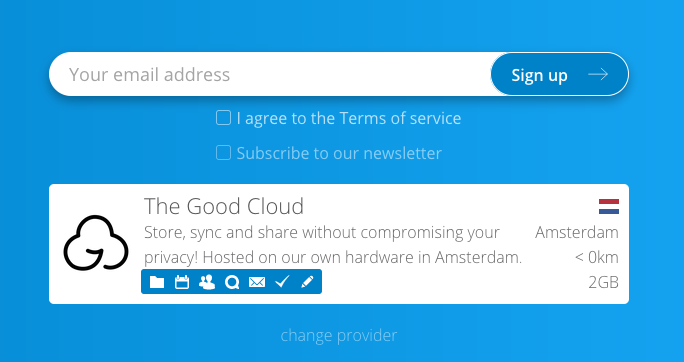

### The Design Problem

In a centralized world, onboarding users to a service doesn't involve too many
individual decisions. Data is hosted in the same place, permissions are handled
by an administrator, and if problems arise — from questions around app usage,
privacy policies, or tracking logs and activities — it's often all in the same
hands of the service provider.

In a decentralized world, onboarding users to a service require many user-side
decisions. Data can be hosted by different parties; permissions can be handled
by end users, super users, or the protocol itself; and if problems arise, it's
unclear who or what to approach.

A good design practice is to provide default options when onboarding. The app
and protocol developers should think about sensible options for its user group,
and offer them as pre-selected, out-of-the-box options. For example, when you
are choosing a hosting provider (the party that will host an instance of your
software, as it is in federations), you should always provide a default,
recommended "host" and not let users research and choose among the many
options.

But this introduces another special problem: if all users get the same default,
recommended "host", then that host will become a super server in the networks,
thus accidentally introducing centralization again.

### The Design Solution

The solution here is simple: if there is no reason to choose one hosting
provider over another, randomly assign new users to a hosting provider.

### Examples

::: examples

- [ Nextcloud randomly selects a server for you](Nextcloud.png)

:::

### Why Choose Host Roulette ?

- When you want to steer the network into further distribution

### Best Practice: How to Implement Host Roulette

- Make sure you indicate that the host was randomly chosen, e.g. write "choose
  a different host" next to it, and visualizing the next randomly assigned host
  in a similar fashion. Think about animating this, too.
- Always offer users their own choice by making the choice editable (choose
  from list, for example).

### Potential Problems with Host Roulette

Host Roulette only works if the options are truly equal. If you are building
a social networks (more than an infrastructural network), you might want to
present and even showcase different communities differently. In those cases,
**choice matters**, and no default option should be provided at all. Instead,
think about the 3-5 bigger communities that you want to offer as options, and
test the copy with users to see if they all sound similarly attractive. See  
[[Vilage or City]] for ways to describe  

### The Take Away

Host Roulette can help you decentralize a network among equal, federated
servers.

## References & Where to Learn More

[Nextcloud's design decision](https://opensource.com/article/20/9/decentralization-signup)
