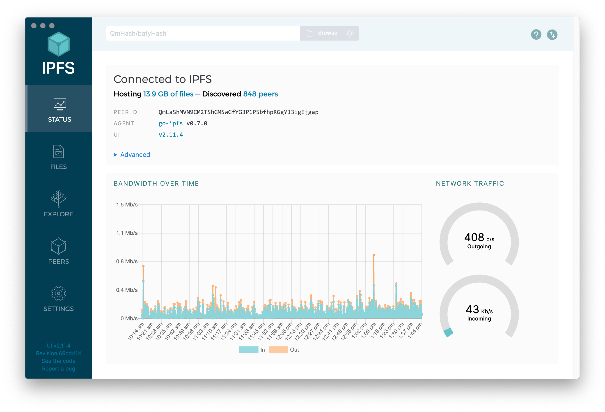
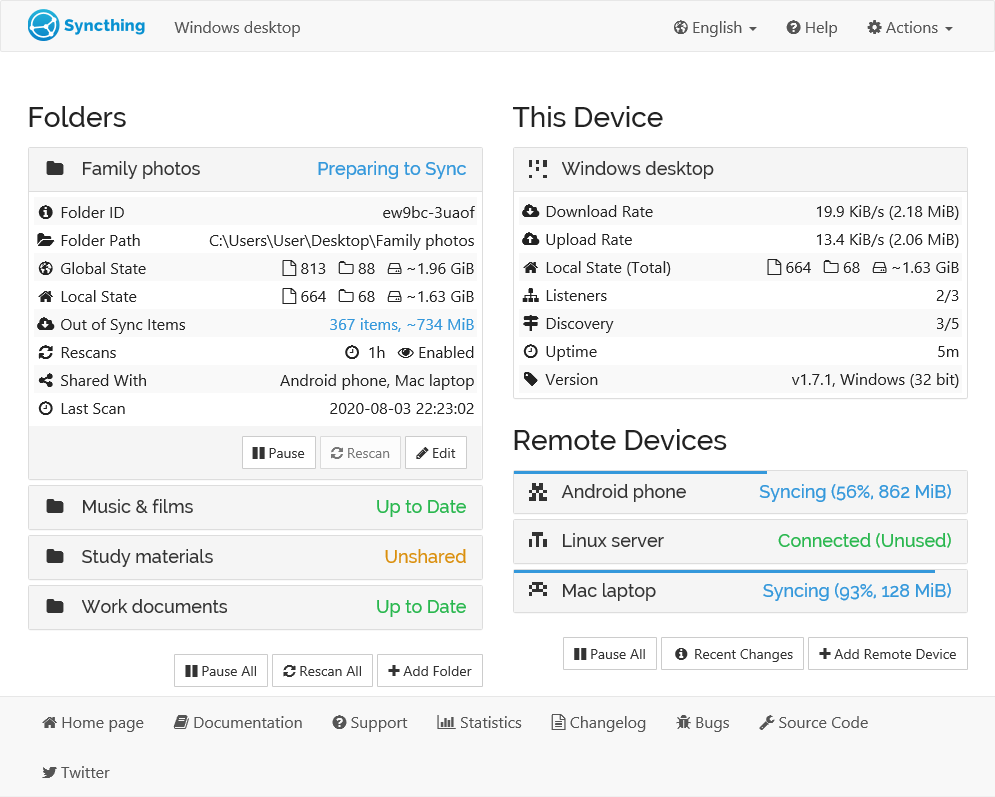

## The Design Problem

In a centralized world, users trust a particular server with data. It's assumed
that the website will always be online, and if it goes down, you aren't able to
access that data.

In a decentralized world, we're able to increase the resillience of data by
relying on multiple providers instead of a single provider. This means that if
for some reason one service loses your data, another provider will have a copy.

However, in a peer to peer or federated application, each of these servers is
run by a different entity. It's sometimes unclear how and when these servers
are online.

## The Design Solution

Monitor and record device that downloads data. Keep a history of
the time that data was syncronized for each device, and periodically check on
these devices to ensure they have the latest copies. You can use this in
conjunction with [[conditional-sharing]] to intelligently
syncronize data to new devices.

Allow the user to see what other devices have access and are rehosting their
data to the network. Visualize this information in the user interface at
multiple scales depending on the details necessary per screen. You can use this
in conjunction with [[age-indicator]] to understand how long
it's been since a device has seen another, helping users understand if their
data is safely replicated to another device and they can turn off their computer.

::: examples

- [ uTorrent provides a dense overview of network traffic](network-health-indicator-utorrent.png)

- [ IPFS gives it a modern touch](network-health-indicator-ipfs.png)

- [ Syncthing provides device monitoring & control](network-health-indicator-syncthing.png)

::: examples

## Why Choose Network Heath Indicator?

- Confirm that shared data remains widely available
- Confirm that hosts supply data for a long time
- Confirm that hosts do _not_ continue providing files after a deletion request
- Identify peers with similar interests

## Best Practice: How to Implement Network Health Indicator

- Allows users to perform self-diagnosis and debug their own network and get updated on the uptime of other devices.
- Provides a variety of different network indicators such as confirmation of uptime, number of active connections, percent downloaded, etc.

## Potential Problems with Network Health Indicator

- There can be a lot of information about each device that isn't really useful
  to all users. Some users will want to see advanced information, like the IP address. Consider 'advanced' and 'basic' views that users can toggle on or
  off depending on what they need from the interface.

- Keeping a local database may not be enough to have the full scope of history,
  especially in peer to peer applications. Consider gossiping the data as part
  of the replication protocol. For example, if Bob syncronizes with Sally, and
  then logs off. Later Sally syncronizes with John, and John logs off. When Bob
  logs back on, he will not know that John also has the data. Sally's device
  should automatically tell Bob that she saw John while Bob was offline. This
  will ensure that users know who has seen the latest information.

- Some protocols by default will not have the ability to acknowledge or verify how much
  of a dataset has been replicated by particular devices. This is required
  to make Network Health Indicator more informative and accurate.

- Network Health Indicators may be unreliable in offline (i.e., [sneakernet](https://en.wikipedia.org/wiki/Sneakernet)) networks,
  where people share data offline using hard drives or other physical methods.
  This is also true for applications where users may disconnect from the network
  for large stretches of time. Implementing indicators in these environments may
  require tracking detailed network health history rather than continued uptime.
  Alternatively, utilize a notification protocol, such that peers notify one another
  when they are connected and available, rather than nodes polling all peers
  periodically to discover availability.

## The Take-Away

Network health indicators reassure users and build trust in your application.

## References & Where to Learn More

Network health indicators overlap with reputation and trust management, in that hosting data for a long period of time can be used to gauge the reliability of a peer. See [[cautious optimism]] and [[conditional file sharing]]. There are potential applications related to preventing DDoS and Sybil attacks.

Network [heartbeats](<https://en.wikipedia.org/wiki/Heartbeat_(computing)>) confirm _lack of data availability_, a component of [[tombstones]].

Tracking peers that re-host content can be used for social peer discovery, because someone mirroring files on an obscure topic likely shares that obscure interest.
