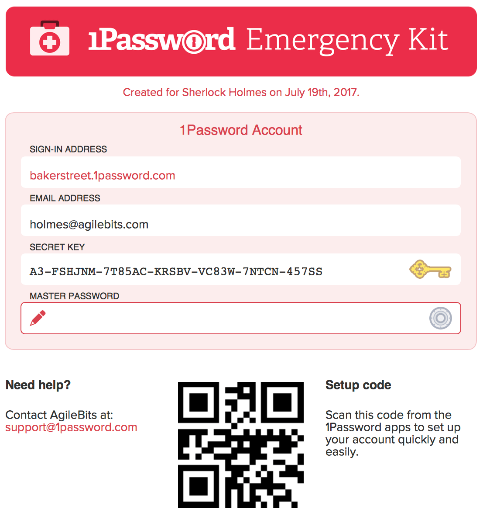
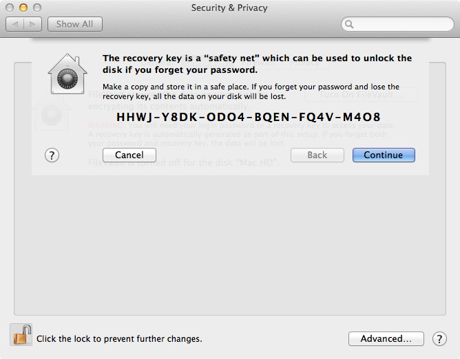

### The Design Problem

When wanting to grant access to a resource in a decentralized system, we can't
necessarily depend on a trusted entity. Instead, we use a randomly generated
list of numbers and letters, commonly called "keys," that grant access to
resources. A resource could be an account, a group invitation, or a piece of
data.

These passwords can be very large, sometimes hundreds of
characters. Because of this, it can be difficult to save or share these keys
in the physical world.

### The Design Solution

The user can save or print a file that can be used to gain access to the
resource. The file itself should be easily human readable and printable.

You can use this in conjunction with the [[QR Code
verification]] pattern to make it easier to import the
codes with the device's camera.

#### Examples

- [ 1Password offers an all-in-one 'Emergency Kit'](paper-keys-1password.png)

- [ Apple Filevault uses a serial number style key](paper-keys-filevault.png)

- [ Keybase generates a multiple word passphrase](paper-keys-keybase.png)

### Why Choose Paper Keys?

Paper Keys is a safe and accessible method to verify, share, or backup information.

### Best Practice: How to Implement Paper Keys

It is advisable that users know the risks, and have a secure and oragnised
place to store the keys. Be clear with users that they should print it or
save it in a safe backup location in case their device gets lost or stolen.

### Potential Problems with Paper Keys

If lost, access to data is potentially lost permanently.

If found by an adversary, it can lead to unauthorized access to data.

### References & Where to Learn More

Projects by IF has outlined a similar design pattern called [Recovery Codes](https://catalogue.projectsbyif.com/patterns/recovery-codes/).

[Investigating the Usability Issues Non-Crypto Savvy Users Encounter When Setting Up Desktop Wallets](https://medium.com/chockablock-io/investigating-the-usability-issues-non-crypto-savvy-users-encounter-when-setting-up-desktop-68323106587b)
