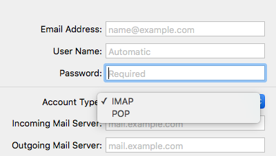
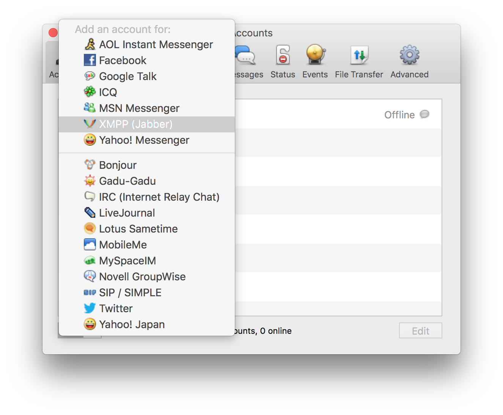
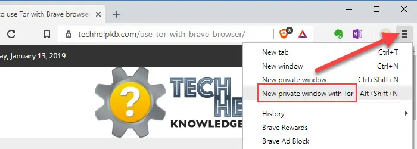

## The Design Problem

Two computers connect directly to each other to exchange using information by using a protocol. Protocols have different strengths and weaknesses for particular use cases.

When an application needs to support a variety of user needs and personas, it can limit usability to only support one protocol. Decentralized applications that support multiple protocols for different scenarios need to know when and where within the user interface to expose those choices.

## The Design Solution

Give users the option to choose a protocol as their default communication method for their given profile. Offer explanatory in-app tutorials to help users understand which choices are the best for them.

### Examples

::: examples

- [ Email clients require users to choose either POP or IMAP.](protocol-agnosticism-email.png)

- [ Adium allows users to select from a variety of different chat applications.](protocol-agnosticism-adium.png)

- [ Brave offers a 'New Private Window with Tor' option ](protocol-agnosticism-brave.png)

::: examples

## Why Choose Protocol Agnosticism?

Use Protocol Agnosticism if you are supporting a large user base with varied preferences and requirements.

## Best Practice: How to Implement Protocol Agnosticism

- The default protocol should reflect what the majority of your users expect it to be, or what behavior the application is expected to exhibit. This can be confirmed through user testing and prototyping.

- Offer in-app help text that explicitly states a scenario or user story in which one protocol may be useful over another. For example, "IMAP is better if you are going to be accessing your email from multiple devices, such as a work computer and a smart phone. POP3 works better if you are only using one device, but have a very large number of emails." ([source](https://www.name.com/support/articles/205935497-Understanding-the-difference-between-POP-and-IMAP))

## Potential Problems with Protocol Agnosticism

It can be difficult for most users to fully grasp the ramifications of their protocol choices.

## The Take-Away

## References & Where to Learn More
