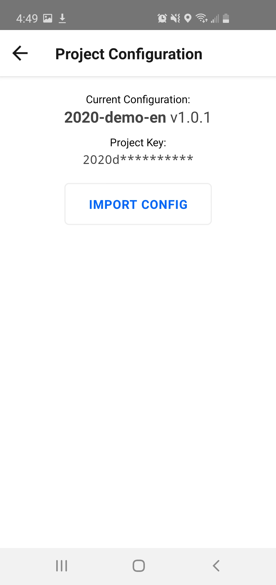

## The Design Problem

Decentralized applications prioritize portability. In other words, data is not tied to one centralized location and should be easily moved between installations, devices, or instances. Although beneficial for many use cases, this feature poses usability challenges when exporting and importing data.

## The Design Solution

When exporting data, such as keys or backups, from the application, ensure that the file has a distinguisable and noticable file extension (e.g., docx or zip). Instead, use the name of your application, or some other name that is unique to your application.

## Examples

- Delta Chat

::: examples

- [ Mapeo users can export and import 'mapeosettings' file to share a proejct between peers](mapeo.jpeg)

- [Delta Chat](https://delta.chat) Delta chat exports chat history backup to a file.

:::

## Why Choose Standards Marker?

When there are sharable or backup files.

## Best Practice: How to Implement Standards Marker

- In the import/open dialog, filter the results in the file picker to only show files with your app's standard extension.
- Make sure that your chosen file extension is unique enough that it is not used by another program.
- Version your file format internally (either using a zip file or some initial byte string) so that you can make changes to the format if necessary.

## Potential Problems with Standards Marker

If you're using a common file format, like sql or zip, it won't be immediately obvious. Include in your help desk and documentation a clear description of what your file format contains and how to use it outside of the application.

## The Take-Away

Standards marker helps users quickly find and open files that are related to your application.
