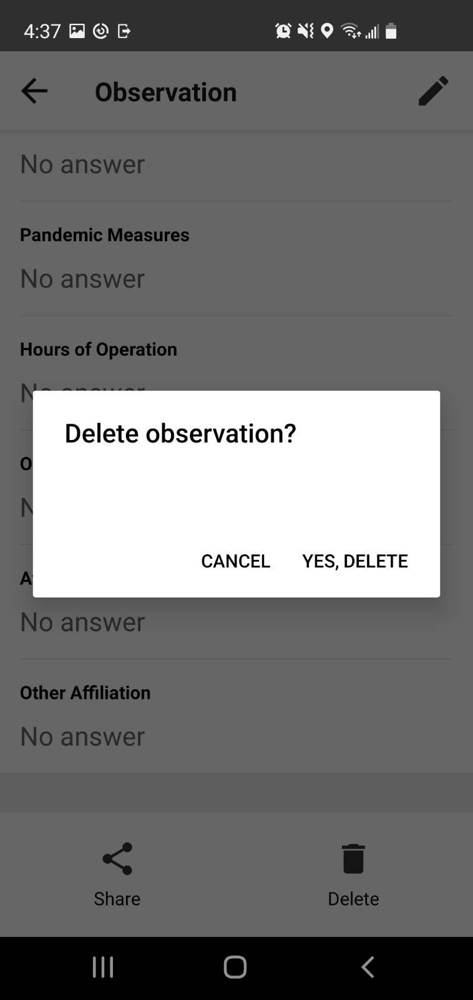

### The Design Problem

User-generated content may be available forever on some devices; and thus, it's difficult to delete all copies of information once it's been copied to other devices. This is more likely the longer this content is online, as crawlers will begin to find it, copy it, and give it to other people.

This deletion problem is not just a decentralization issue. In centralized applications, any conversation could be saved as screenshots or as raw data, long after the original account deleted the information. Thus, it is already very difficult to delete content from the Web once it has been shared.

In a decentralized application, deletion gets even harder, because we can't ask a central database to delete all reference to the data and copies of the data. we may have to ask many databases to delete the data.

### The Design Solution

We can encourage deletion across the network quite well by using Tombstones. A tombstone is a message that says "Please, delete the information with the following reference numbers or ids." This message can be sent to everyone or only certain devices or servers, depending on the use case.

### Examples

::: examples

- [ Mapeo has a delete feature which hides items from view](mapeo.png)

:::

### How to best implement

- When a message is deleted, show users if the content is still available somewhere on the network (e.g., it could be that some client is not respecting the message).
- Some clients may not respect tombstones, give users visibility into this and allow blocking replication with those clients.
- Allow 'reversing' tombstones, that is, a tombstone should be a boolean value that can be turned off or on in the future.

### Why Choose Tombstones?

When you want to protect the safety and privacy of users.

### Potential Problems with Tombstones

It won't always be clear that content won't be deleted immediately from the network. It can take time before the tombstone message is sent to other devices.

Depending on the protocol or library you choose for storage, it may not be possible to delete historical data. In this case, tombstones only 'hide' data from view, rather than delete it from disk.

### References & Where to Learn More

Network "[heartbeats](<https://en.wikipedia.org/wiki/Heartbeat_(computing)>)" can track which peers with a copy of data continue to share it after a tombstone has been sent. See [[network health indicator]] for more on this approach.
