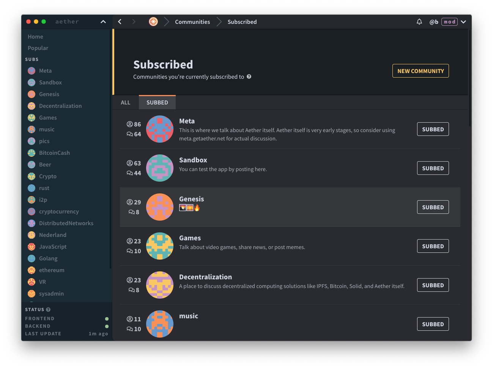

### The Design Problem

When building a new platform (e.g., a social network), it is hard to make design decisions about features and workflows that fit a variety of users, use cases, and contexts. Decentralized technologies often want to be "forked" and implemented by many different and vibrant communities. This means that there won't be a unifying way to describe user groups and their needs, and the design process can feel "stuck".

### The Design Solution

Instead of thinking specifically about user groups and their needs, consider the feeling or atmosphere you want to create.
What kinds of interactions do you want to see? If it’s more like a village, you'll have
close connections with everyone you talk to. Think of a texting app, or an
invite-only chat room. If it's more like a city (think Twitter), your users will have more
interactions with strangers.

Some users will want to be in a village in certain contexts; but some
communities may want to feel more like cities. Making sure your assumptions
about village or city is built into your platform will help users understand
the kinds of interactions that are possible and appropriate. Consider patterns
like [[cautious optimism]] to allow users to opt-in to
discovering new users safely.

If you envision a city-like platform, make posts public and anonymous by default - people are used to random and rude behavior in cities. But if you are building a village-like platform, people will expect posts to be shared within a smaller and safer group.

This aspect also affects community growth. For example, communities that are invite-only will feel more like villages. The more
controls you create around who is allowed to issue invites (e.g., only
moderators/admins or everyone) will further restrict community growth. Give users and moderators clear controls on how to grow their communities.
Utilize patterns like [[social radius slider]]
and [[content curators]] to give fine-grained control over
social feeds.

### Examples

::: examples

- [ Mastodon can be
  configured as invite-only](mastodon.jpeg)

- [ Aether users vote and impeach moderators similar to a democratic city government](aether.png)

:::

### Why Choose Village or City?

When you are building an application that relies heavily on social interaction.

### Best Practice: How to Implement Village or City

- Guidelines and parameters regarding community size and interactive elements
  must be communicated clearly.

### Potential Problems with Village or City

It can cause more cognitive load to have more choices in moderation,
community interaction, and growth. Decide on where you fall on the "Village or City?" spectrum and make consistent design decisions throughout.
Create default settings or an in depth onboarding flow that helps moderators and users understand what the
implications are for community openness, public visibility, and invitation rules.

### The Take-Away

Users will feel more grounded and active on your platform when community
boundaries are clear and aligned with what they are looking for.

### References & Where to Learn More

[Run Your Own Social](https://runyourown.social/)
