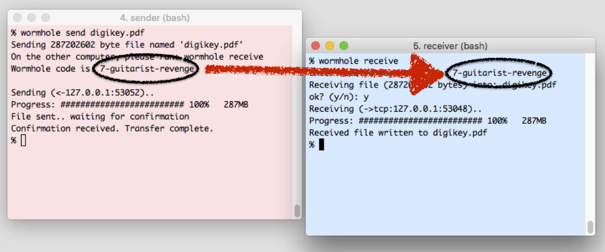
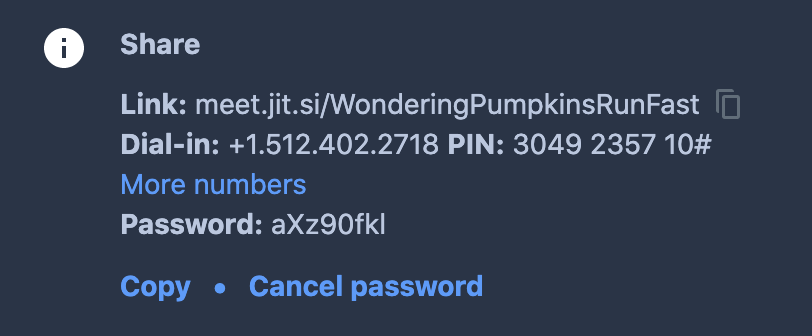
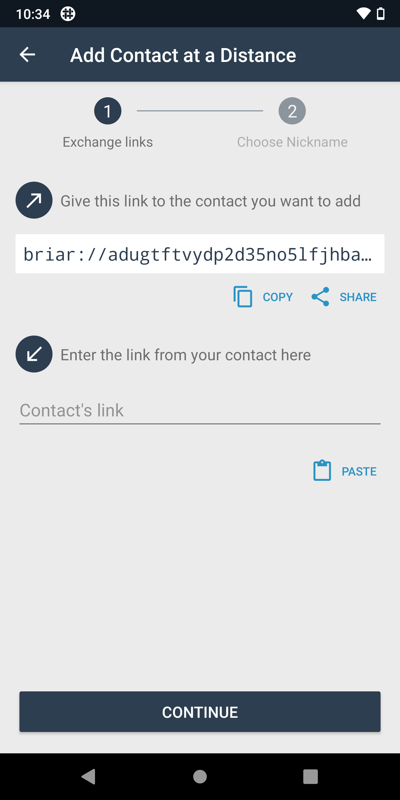

## The Design Problem

In a peer-to-peer application, two devices are able to connect their computers
and share content directly. However, stabilizing that initial connection can be
challenging.

## The Design Solution

One user creates a code that can be shared with the other easily using another
communication channel. The code should be short and human-pronounceable, using
a phonetically-distinct wordlist.

Consider using a URI protocol handler link (e.g., myapp://<whisper-link-here>) so that
when clicked on, your application will automatically open.

## Examples

::: examples

- [ Magic Wormhole automatically generates pronouncable phrases](whisper-links-magicwormhole.png)

- [ Jitsi allows users to choose a phrase](whisper-links-jitsi.png)

- [ Briar's phrases are cryptographicly secure but unpronouncable](whisper-links-briar.png)

::: 

## Why Choose Whisper Links?

When you want to establish a connection between two users for common use cases
where there is a human-mediated communication channel (such as text, chat, or
phone call) already in progress.

## Best Practice: How to Implement Whisper Links

If using a wordlist, localize it. In other words, use a wordlist language that
is the same as the user's chosen language.

Allow users to create their own whisper links.

Consider only allowing a certain number of failed attempts to protect against spammers and brute-force attacks. See [password-authenticated key agreement](https://en.wikipedia.org/wiki/Password-authenticated_key_agreement) for more implementation details.

This could be used in conjunction with [[QR code verification]] if two users are able to share an image or
are in the same physical location.

## Potential Problems with Whisper Links

Use longer lengths for higher security use cases and shorter lengths for
links intended to be publicly accessible. The longer the code, the less likely
it is that an attacker could randomly guess the whisper link and connect to
an unauthorized computer. However, longer links may be more difficult to copy
and remember.

When users are able to choose their own whisper links, it's possible they will
choose names that are easy to guess. Consider implementing a "bad meeting name
detector" which tells users when their link could be hijacked by an suspicious
third-party attacker.

## The Take-Away

Whisper Links make it easy to share information quickly between two trusted users.

## References & Where to Learn More

[What Three Words](https://what3words.com/about-us-old/) maps every 3x3m location on earth to three words! This is how powerful three words alone can be.
